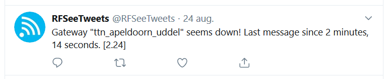
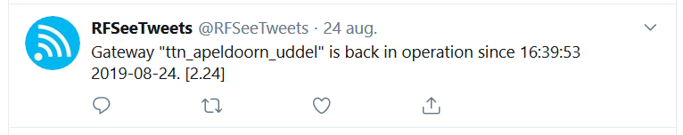
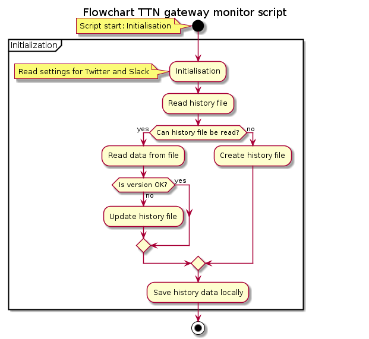
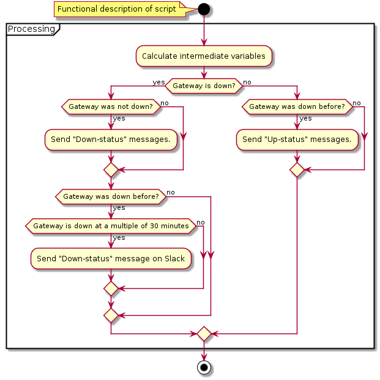
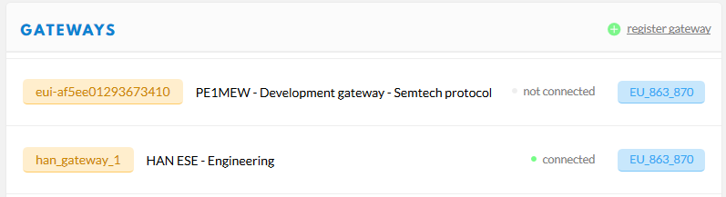
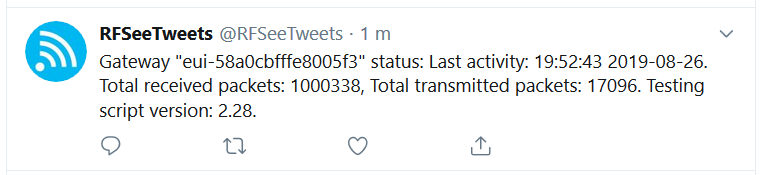

# TTN-Gateway-monitor
A script that monitors a TTN gateway and sends status and updates to Twitter and Slack

## Disclaimer
The PE1MEW TTN Gateway monitoring script is distributed in the hope that it will be useful, but WITHOUT ANY WARRANTY; Without even the implied warranty of MERCHANTABILITY or FITNESS FOR A PARTICULAR PURPOSE.
## License
The PE1MEW TTN Gateway monitoring script is free software: You can redistribute it and/or modify it under the terms of a Creative Commons Attribution-NonCommercial 4.0 International License (http://creativecommons.org/licenses/by-nc/4.0/) by PE1MEW (http://pe1mew.nl) E-mail: pe1mew@pe1mew.nl.

<a rel="license" href="http://creativecommons.org/licenses/by-nc/4.0/"></a><br />This work is licensed under a <a rel="license" href="http://creativecommons.org/licenses/by-nc/4.0/">Creative Commons Attribution-NonCommercial 4.0 International License</a>.
# Introduction
With the expansion of The Things Network (TTN) the number of gateways is rapidly increasing. Together with these new gateways the need for a adequate monitoring is more urgent than ever. Information a gateway owner would like to have is if the gateway is on-line or not and performance figures. This information should be made available to the gateway owner and to the users as TTN is a public network. This solution aims to do just that: Present status information and events with respect to a TTN Gateway on Twitter and Slack.

With TTN V2-stack there is no solution for real-time monitoring. This might change in the future when V3-stack is put in operation but for now the TTN-Gateway-monitor script is using the information that the TTN V2-stack is providing to create a "real-time" monitoring system of TTN Gateways.

This script is inspired on the article <a href="https://www.disk91.com/2019/technology/lora/alarm-your-thethingsnetwork-gateway/">"Alarm your TheThingsNetwork gateway"</a> of Paul. The practical implementation using IFTT did not work for me as I do not like the idea of cluttering my Email with event messages. So I searched for alternative ways to get information published. 

I found the solution for Twitter in <a href="https://projects.raspberrypi.org/en/projects/getting-started-with-the-twitter-api">"Getting started with the Twitter API"</a> and for Slack at <a href="https://api.slack.com/incoming-webhooks">"Send data into Slack in real-time"</a> .
# Functionality
The script is run at regular intervals (5 minutes by default) where it requests the status of a gateway from the V2-stack of TTN. This actual status information is than evaluated in combination with (locally stored) historical status information. As a result of the evaluation the script determines if the gateway is "up" or "down".

A gateway is assumed to be "down" or "off-line" when the gateway is not "heard" for a period longer than 120 seconds by the V2-stack.

- When the observed gateway is found to be "up" and the previous state ws not down no message is sent.
- When the observed gateway is found to be "down" a message is sent on Twitter and Slack that states for how long the gateway is down. This message is repeated every 30 minutes on Slack (Not Twitter) as a reminder.
- When the observed gateway is found to be "up" after being down, a message is sent on Twitter an Slack that states when the gateway has come back on-line and for how long the gateway was off-line.

Tweet when a gateway is observed to be "down":


Tweet when a gateway is observed to be "up":


To see the script in action follow mt Twitter account RFSeeTweets at https://twitter.com/rfseetweets.

# Limitations
There are some limitations or down-sides to this solution: The Things network is a community network that is provided as-is. this means that the network is operational at best-effort and that no service level agreements are in place!. As a result of this The things network or parts of this service can be down or unavailable for unlimited time.

The solution presented here is 100% dependant on the availabilty of the API that presents gateway status. As a result of that, this script may not present the correct or actual status when the API fails or is down. 

History shows that while gateways are operational and applications run fine, the API used by the script has beenseen unreliable for periods of time. This will affect the operation of the script. therefore the script is for indication purpose only. Do not rely on the presented results or make systems depending on this script for its operation!
# Implementation
The TTN V2-stack is offering gateway status in JSON-format over the link: "http://noc.thethingsnetwork.org:8085/api/v2/gateways/<gateway_id>". The JSON struct delivered is presented below:
```
{
    "timestamp": "2019-08-22T08:23:44.121907589Z",
    "authenticated": true,
    "uplink": "13169328",
    "downlink": "78539",
    "location": {
        "latitude": 52.215855,
        "longitude": 5.963744,
        "altitude": 45
    },
    "frequency_plan": "EU_863_870",
    "platform": "IMST + Rpi",
    "gps": {
        "latitude": 52.215855,
        "longitude": 5.963744,
        "altitude": 45
    },
    "time": "1566462224121907589",
    "rx_ok": 13169328,
    "tx_in": 78539
}
```
From this struct the field "time", "rx_ok" and "tx_in" are being used.
- "time", is the epoch time (UTC!) in seconds at which the last message was received from the gateway by the V2-stack
- "rx_ok", is the total number of uplink packets received from the gateway at the time stated in "time"
- "tx_in", is the total number of downlink packets transmitted to the gateway at the time stated in "time"

The script is performing the following actions:
1. Initialisation:
   - Read credentials for Twitter API
   - Read url for Slack webhook
   - Read history data from previous execution of script
     - When file does not exist (at first use) create an new file with default values
     - Verify format of history file; when not OK update history file



2. Generate intermediate results 
3. Retrieve last information from TTN
4. Analyse information and send messages to Twitter and Slack.



## Periodic execution
Periodic exectution of the script is implemented usig crontab that is available on any linux host OS. The crontab is configured to execute the script at an interval of 5 minutes. 

To allow multiple gateways to be monitored using a single script arguments are mandatory to specifiy the gateway-ID and teh interval at which the scipt is called form crontab. The syntax of the monitor script is:
```
./gwmonitor <gateway_name> <cron_interval_seconds>
```
# Installation
## Prepare the Linux host OS
Make sure the following programs are installed:
- github
- python
## Install on Linux host OS
_Preferrably start in the home directory of the user that will execute crontab._ 
Download the repository of the gateway monitor script:
```
git clone https://github.com/pe1mew/TTN-Gateway-monitor.git
```
copy the directory "gwstatus" to the location where crontab will execute it from: 
```
cp ~/TTN-Gateway-monitor/gwstatus/* ~/gwstatus/
```
Go to the directory where the script is located: 
```
cd ~/gwstatus/
```
Make the script executable:
```
chmod +x gwmonitor.sh 
```
Install mandatory python libraries: requests, dateutils, Twython
```
pip install requests
pip install dateutils
pip install Twython
```
Your scripts are now setup to be executed.

# Configuration

## Prerequisites
Before we run the script we have to setup access to Twitter and Slack and collect information from TTN about the gateway we will be monitoring. Keep track of all te information in a small ASCII logbook on, for example, notepad++. We than can simply copy all information to where we need it.
### Gateway-ID
The gateway-ID is obtained trough console at TTN as can be seen in the following example:



A gateway ID can be in two formats depending on the packet forwarder used by the gateway:
1. Packet forwarders that connect using the Semtech UDP protocol (such as the Semtech UDP Packet Forwarder). These gateways will be know as "eui-b827ebfffe87bd11" for the Gateway ID and shall be identified as such with the scipt.
2. Packet forwarders that connect using the new TTN Gateway Connector protocol (such as the TTN Packet Forwarder). These gateways will be know with the 'human readable ID'such as: "han_gateway_1" for the Gateway ID and shall be identified as such with the scipt.
```
Copy the Gateway ID from TTN console to your notepad.
```
This gateway ID will be used as argument when calling the gateway monitor script.
### Twitter API credentials
Make sure you have a Twitter account that can be used for your gateway information.
Follow the tutorial <a href="https://projects.raspberrypi.org/en/projects/getting-started-with-the-twitter-api">"Getting started with the Twitter API"</a> and follow the instructions at <a href="https://projects.raspberrypi.org/en/projects/getting-started-with-the-twitter-api/3">"Apply for a Twitter developer account"</a> and <a href="https://projects.raspberrypi.org/en/projects/getting-started-with-the-twitter-api/4">"Create a Twitter application"</a>

If all things went will you end up with your Consumer API key, Consumer API secret key, Access token, and Access token secret. You need these four keys to connect to your Twitter account from your Python program. Save the credentials in the file: "twitter_auth.py" that is located in the same directory where the monitor script is located:
```
# Credentials for Twitter API
consumer_key        = 'aaaaaaaaaaaaaaaaaaaaaaaaa'
consumer_secret     = 'bbbbbbbbbbbbbbbbbbbbbbbbbbbbbbbbbbbbbbbbbbbbbbbbbb'
access_token        = 'cccccccccccccccccccccccccccccccccccccccccccccccccc'
access_token_secret = 'ddddddddddddddddddddddddddddddddddddddddddddd'
```
### Slack webhook credentials
Make sure you have a Slack account that can be used for your gateway information and a channel where the information will be posted. 
Follow the tutorial <a href="https://api.slack.com/incoming-webhooks">"Getting started with Incoming Webhooks"</a>

If all things went will you end up with your Incoming Webhook URL. You need this url to post messages from your Python program on Slack. Save the credentials in the file: "slack_auth.py" that is located in the same directory where the monitor script is located:
```
# Credentials for Slack API
webhook_url = 'https://hooks.slack.com/services/aaaaaaaaa/bbbbbbbbb/cccccccccccccccccccccccc'
```
### Setup crontab
To execute the script crontab is being used. As crontab is a service in a Linux system that needs to be updated after that the configuration is altered we will use the command "crontab -e". This will open the default editor for your Linux OS with the crontab configuration file. After that the edits are saved and editor is closed the crontab will be updated with the new configuration.

Start editing the crontab configuration file:
```
crontab -e
```
Add the following line at the end of your crontab file. Make sure that 'gateway-ID' is replaced by the gateway-ID of the gateway that you will monitor:
```
*/5 * * * * cd ~/gwstatus && ./gwmonitor.sh <gateway-ID> 300 >> /var/log/gwmonitor.log$
```
The part ">> /var/log/gwmonitor.log 2>&1" will ensure that outpur from the script is stored in a logfile for anlysis afterwards.
#### Note
It might be possible that the user executing the script is not allowed to write the log file. To solve this issue add the user to the group owning /var/log directory.
## Testing your installation
To test your installation run the script with the repeat interval of '0'. This will make the script send a test message on both Slack and Twitter.
```
./gwmonitor.sh <gateway-ID> 0
```
Tweet when a testing the script:


# Modifications(hacks)
To enable or disable Tweesting or posting messages on Slack disable the calls "sendSlack(upMessage)" and/or "sendTweet(upMessage)".
